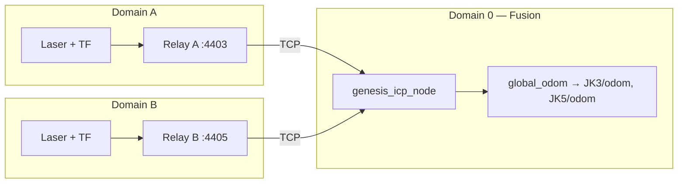

<div align="center">

# genesis_icp

ROS2 **MultiRobot Relative Pose Estimator** with Cross-domain LiDAR TCP relays and Karto correlative scan matching

[](https://docs.ros.org/)
[](#license)

</div>

---

## Overview

Multi-robot SLAM stacks often require know poses for robots. In a real-world Multi-robot setup, each robot runs in its own **`ROS_DOMAIN_ID`** so topics do not collide and traffic is isolated. **genesis_icp** bridges that gap:

1. **Socket relays** on each robot subscribe to local scans + TF, serialize a compact wire packet, and stream it to a central **fusion** process.
2. The **fusion node** runs **Karto**’s sequential scan matcher to estimate the **relative pose** between the laser frames.
3. It publishes **static `tf2` messages** so robots can agree on a common **`global_odom`** frame (configurable anchor: robot A, or midpoint).

**odom-free matching** ignores wheel odometry in packets when each robot reports ~(0,0,0) but the physical layout varies; **multi-seed** search explores a coarse grid of pose hypotheses to reduce sensitivity to a single bad initial guess.

---

## Architecture



---

## Requirements

- **ROS 2** (tested with **Humble** / **Jazzy**)
- **colcon** workspace
- Dependencies (via `rosdep` / distro packages): `rclcpp`, `sensor_msgs`, `geometry_msgs`, `tf2`, `tf2_ros`, `tf2_geometry_msgs`, `tf2_msgs`, **Eigen3**, **Boost**, **TBB**, `python3-yaml`

---

## Build

Clone this package into your workspace `src/` tree (as a standalone repo or subtree), then:

```bash
cd /path/to/your_ws
rosdep install --from-paths src/genesis_icp -y
colcon build --packages-select genesis_icp
source install/setup.bash
```

---

## Live operation

Launch **relays** (on robot domains) and **fusion** (on a separate domain, default **0**):

```bash
ros2 launch genesis_icp genesis_icp_with_relays.launch.py
```

Useful launch arguments:

| Argument | Typical live value | Notes |
|----------|-------------------|--------|
| `use_sim_time` | `false` | `true` only with `ros2 bag play --clock` |
| `robot_a_ros_domain_id` / `robot_b_ros_domain_id` | `3` / `5` | Must match where each relay runs |
| `fusion_ros_domain_id` | `0` | Fusion + RViz / global consumers |
| `config_file` | package `config/genesis_icp.yaml` | Topics, frames, Karto params |

Tune **`genesis_icp.yaml`** for scan topics, frame names, **`use_odom_poses_for_match`**, **`multi_seed_*`**, and **`correlation_search_space_*`** (grid size must satisfy Karto’s integer constraint on dimension / resolution).

---

## Offline replay (rosbag2)

The **`genesis_icp_offline_node`** executable reads **two rosbag2 folders** directly (via **rosbag2_cpp**). It does **not** use socket relays, **`ros2 bag play`**, or multiple **`ROS_DOMAIN_ID`** values. TF and scans are replayed in timestamp order into the same Karto scan-matching core as the live **`genesis_icp_node`**.

1. Edit **`config/offline_genesis_icp.yaml`**: set **`robot_a_bag`** / **`robot_b_bag`** to your bag directories, and align **`robot_*_scan_topic`** / **`robot_*_tf*`** with the names stored in each recording. Set **`odom_frame_robot_*`** / **`base_frame_robot_*`** to the frame IDs **inside the bag** (often `odom` / `base_link` per robot, same as the socket relay—not necessarily `JK3/odom` from the live fusion YAML).
2. Tune Karto / frames in **`config/genesis_icp.yaml`** (or pass **`fusion_config:=`**). Prefer **`use_odom_poses_for_match: true`** in the offline overlay when bags include meaningful odom-linked TF.
3. Launch:

```bash
ros2 launch genesis_icp offline_genesis_icp.launch.py
```

Optional launch arguments:

| Argument | Role |
|----------|------|
| `fusion_config` | Defaults to package **`config/genesis_icp.yaml`** |
| `offline_config` | Defaults to package **`config/offline_genesis_icp.yaml`** |

Example custom overlay only:

```bash
ros2 launch genesis_icp offline_genesis_icp.launch.py \
  offline_config:=/absolute/path/to/my_offline.yaml
```

**`playback_realtime_factor`**: `0` processes messages as fast as possible; `1.0` approximates wall-clock spacing between bag timestamps. **`max_bag_messages`** (non-zero) stops after *N* messages for quick tests.

---

## Integration test script

`scripts/run_bag_integration_test.sh` is an optional helper. **Do not hardcode machine paths in git** — set environment variables before running:

```bash
export WS=/path/to/colcon_ws
export BAG_JK3=/path/to/jk3_bag
export BAG_JK5=/path/to/jk5_bag
export LOGDIR=/tmp/genesis_icp_logs   # optional
export ROS_DISTRO=humble               # optional
./scripts/run_bag_integration_test.sh
```

For a permanent local setup, use a **`*.local.sh`** file (ignored by `.gitignore`) that exports your paths and calls the script.

---

## Parameters (quick reference)

| Area | File / node |
|------|-------------|
| Fusion + Karto | `config/genesis_icp.yaml` → `genesis_icp` / `genesis_icp_offline_node` |
| Offline bag paths + per-bag topics | `config/offline_genesis_icp.yaml` |
| Relay TCP ports / scan topic | `genesis_icp_with_relays.launch.py` + relay node params |

---

## License

This repository contains **multiple licenses**:

| Component | License / terms |
|-----------|-----------------|
| Original **genesis_icp** sources (e.g. fusion node, relays, wire protocol, launches, configs authored for this package) | **MIT** — see file headers and `package.xml`. |
| **`lib/karto_sdk/`** (Karto Open Source Library) | **LGPL-3.0** — see [`lib/karto_sdk/LICENSE`](lib/karto_sdk/LICENSE) and [`lib/karto_sdk/Authors`](lib/karto_sdk/Authors). |
| **`laser_utils.cpp` / `laser_utils.hpp`** | **Creative Commons** terms and copyright **Samsung Research America** — see file headers. |
| **`mapper_configure.cpp`** | Derived from **slam_toolbox**; retain upstream copyright and license obligations. |

You are responsible for complying with **all** applicable licenses when you build, distribute, or link this package. *This README is not legal advice.*

---

## Acknowledgments

- **[Karto](https://github.com/ros-perception/open_karto)** / **Karto SDK** — correlative scan matching and mapping library (vendored under `lib/karto_sdk/`). Thanks to SRI contributors and maintainers who carried Karto into the ROS ecosystem.
- **[slam_toolbox](https://github.com/SteveMacenski/slam_toolbox)** — configuration patterns and Karto integration; **`mapper_configure.cpp`** is derived from slam_toolbox’s mapper setup.
- **Samsung Research America** / **Steven Macenski** — **`laser_utils`** sources adapted from slam_toolbox’s laser utilities (Creative Commons license in file headers).
- **ROS 2** community — `rclcpp`, `tf2`, `sensor_msgs`, and launch infrastructure.

---

## Maintainer

**Mike Degany** — [mike.degany@gmail.com](mailto:mike.degany@gmail.com)

---

<div align="center">

*Questions and PRs welcome.*

</div>
